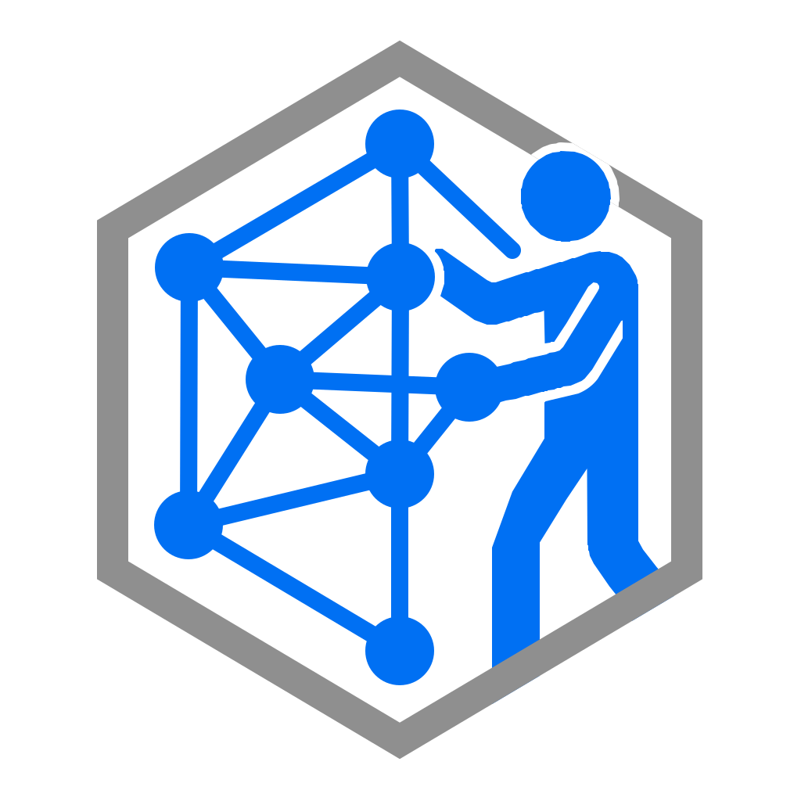

<p align="center">
  
</p>

<h1 align="center">GraphMan</h1>

<p align="center">A Rust graph library that measures itself, and an observatory that runs it in your browser.</p>

<p align="center">
  <a href="https://github.com/lkzppm/GraphMan/actions/workflows/ci.yml"></a>
</p>

<p align="center">
  <a href="https://graphman-ufrj.vercel.app">graphman-ufrj.vercel.app</a> ·
  <a href="https://graphman-ufrj.vercel.app/observatory">observatory</a> ·
  <a href="https://graphman-ufrj.vercel.app/studies">case studies</a> ·
  <a href="https://graphman-ufrj.vercel.app/presentation">presentation</a>
</p>

GraphMan is the course project of *Teoria dos Grafos* (COS 242, UFRJ). Part 1
covers undirected graphs: two representations (plus CSR as a third), BFS/DFS,
distances, diameter, connected components, and a reproducible case study on
six graphs from 10 thousand to 4.8 million vertices. Part 2 adds real edge
weights to the same graphs and representations, and shortest paths with one
Dijkstra over interchangeable frontiers: a vector scanned for the minimum and
a binary heap with decrease-key. Vertices can be named (the collaboration
network), and a graph with a negative weight is refused, not answered wrongly.

## What is in the box

| Piece | Where | What it does |
|---|---|---|
| `graphman` | `crates/graphman` | The library: `Graph` and `Weighted` traits, adjacency list / bitset matrix / CSR (weighted or not), traversals with visitors, components, four diameter strategies, Dijkstra over three frontiers, vertex names, memory metrics. |
| `graphman` CLI | `crates/graphman-cli` | One subcommand per assignment feature (`info`, `bfs`, `dfs`, `distance`, `diameter`, `components`, `dijkstra`), plus `bench`, `memory`, `generate` and `study` (the case-study runner). |
| `graphman-wasm` | `crates/graphman-wasm` | The library compiled to WebAssembly for the browser. |
| Site | `web/` | Next.js, bilingual (Portuguese by default, English by a switch), phone-ready: the landing page, the library page with runnable examples, the seven case-study questions drawn, the presentation deck, and the observatory: drop a graph file, drag its vertices, pick an origin and watch BFS/DFS unfold on the GPU (vgpu / WebGPU). |

## Quick start

```bash
# Library + CLI
cargo build --release
./target/release/graphman info graphs/grafo_1.txt              # summary file
./target/release/graphman bfs graphs/grafo_1.txt --from 1      # parent + level of every vertex
./target/release/graphman distance graphs/grafo_1.txt --pair 10 20
./target/release/graphman diameter graphs/grafo_1.txt -m bounds
./target/release/graphman components graphs/grafo_1.txt
./target/release/graphman study graphs/grafo_1.txt --out studies   # JSON + RESULTS.md

# Weighted graphs (Part 2): a third column `u v weight`
./target/release/graphman dijkstra samples/weighted_100.txt --from 10 --to 20 30 40 50 60
./target/release/graphman dijkstra samples/weighted_100.txt --from 10 --frontier vector
./target/release/graphman bench samples/weighted_100.txt --algo dijkstra --frontier heap -n 100
./target/release/graphman dijkstra samples/collaboration.txt --names samples/collaboration_names.txt \
    --from "Edsger W. Dijkstra" --to "Alan M. Turing" "Éva Tardos" "Daniel R. Figueiredo"
./target/release/graphman generate --like graphs/grafo_1.txt --weights 0:1 -o grafo_W_1.txt

# Observatory (needs the wasm32-unknown-unknown target; a WebGPU browser to view)
cd web && pnpm install && pnpm run dev
```

Using the library from another program:

```rust
use graphman::{AdjacencyList, Build, EdgeList, Graph, algo};

let edges = EdgeList::from_path("graphs/grafo_1.txt")?;
let graph = AdjacencyList::build(&edges)?;          // or AdjacencyMatrix / Csr
let tree = algo::bfs(&graph, 1);
println!("parent of 10: {:?}, level {:?}", tree.parent(10), tree.level(10));
let d = algo::diameter(&graph, algo::DiameterMethod::IFub);
println!("diameter {} after {} BFS runs", d.value, d.bfs_count);

// A weighted file (`u v weight` lines) builds the same structures.
let edges = EdgeList::from_path("samples/weighted_100.txt")?;
let graph = graphman::Csr::build(&edges)?;
let tree = algo::dijkstra(&graph, 10, graphman::FrontierKind::Heap)?; // or Vector
println!("d(10, 20) = {:?} via {:?}", tree.distance(20), tree.path_to(20));
```

## Design in one paragraph

Storage is a strategy: every algorithm is written once against a five-method
`Graph` trait and monomorphised per representation, so swapping the storage
changes cost but never a result. Traversals report to a `Visitor` and can stop
early; a `SearchTree` is reused across thousands of searches without
reallocating. Builders check a memory budget before allocating (a
375 000-vertex bitset matrix is 17.6 GB). The diameter has four strategies,
exact brute force, iFUB, Takes–Kosters bounding and a 4-sweep bound, all
cancellable with a time budget. Weights are a column beside each
representation's adjacency (BFS never reads it; an unweighted graph weighs 1
per edge), and Dijkstra is written once over a `Frontier` trait, so the
course's vector and heap versions are two strategies of one algorithm that
build the very same tree. Details in `spec/ARCHITECTURE.md` and
`spec/PHASE2.md`.

## Results

`studies/RESULTS.md` holds the latest case-study tables; `studies/results.json`
feeds the site. See `spec/WORKFLOW.md` for how to regenerate them.

## Presentation

The deck lives at [/presentation](https://graphman-ufrj.vercel.app/presentation)
(arrow keys move, F is full screen). `docs/apresentacao.pdf` is a static
export of the five slides and `docs/apresentacao-notas.md` the speaking
notes, both in Portuguese like the course.

## Layout

```
crates/graphman/      library          crates/graphman-cli/   binary `graphman`
crates/graphman-wasm/ wasm bindings    web/                   Next.js site + observatory
studies/              case-study outputs
samples/              small graphs to try (the handouts' figures, a weighted graph, a named network)
spec/                 project knowledge (assignment, architecture, workflow, design)
docs/                 course handouts, the deck as PDF and its speaking notes
graphs/               inputs (gitignored)
```

## License

MIT.
